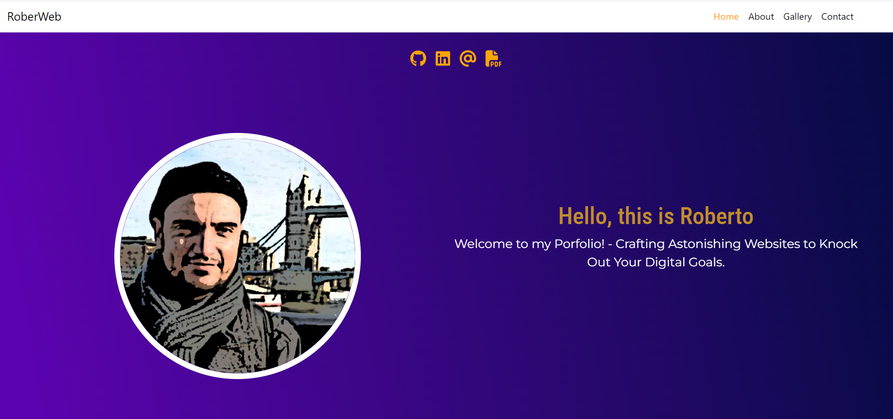

# My React Portfolio

🚀 Welcome to my React portfolio website repository! In this project, I've crafted a dynamic and visually captivating layout using ReactJs to showcase my expertise in web development. This professional design emphasizes my skills, projects, and experiences, providing a comprehensive overview of my journey in web development.

## Comp. Features:

### Templates

##### Header | Navbar | Footer

### Pages

##### HomePage | AboutPage | GalleryPage | ContactPage | CVComponent

### Components

##### Hero | Social | About | | Gallery | Contact | CVPage |

## Used Technologies:

- [ReactJs](https://react.dev/)
- HTML5
- CSS3
- Javascript ES6
- [Bootstrap 5](https://getbootstrap.com/)
- [Animate](https://animate.style/)
- [React Router](https://reactrouter.com/en/main)

## Resources:

- [How to Display PDF in React](https://betterprogramming.pub/how-to-display-pdfs-but-prevent-them-from-downloading-in-react-2e77292ca9a5)

- [Deployment in Hostinger](https://www.youtube.com/watch?v=iCAG7saT358)
  * I could deploy it in Hostinger; however, refreshing the browser makes the pages disappear and generates a 404 not found. Then resolved to start back with netlify.
- [How to Fix Netlify Page Not Found?](https://www.youtube.com/watch?v=Ff6LBcYSlRk&ab_channel=RajeshBhattarai)
- [Create Deploys | Netlify](https://docs.netlify.com/site-deploys/create-deploys/#deploy-with-git)

## Accessing the Portfolio

## Portfolio Address

[View my React Portfolio Website](https://rob-react-portfolio.netlify.app/)
